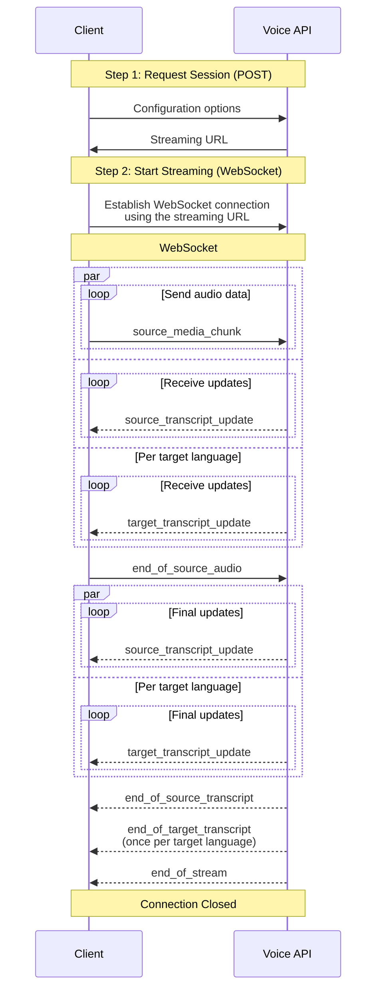

The Voice API provides real-time voice transcription and translation services using WebSocket streaming.

<Info>
  DeepL API for speech to text is now **available on request** for customers with a DeepL API Pro subscription via the v3 API endpoint. The supported scope of DeepL API for the speech to text functionality is covered in this documentation page.
  
  Please note that the existing provisions applying to customers' DeepL API Pro subscription also apply to DeepL API for speech to text with the following applicable additions to the [Terms and Conditions, the Service Specification and the Data Processing Agreement](/api-reference/voice/deepl-voice-api-service-specification-updates) (as a new sub-processor has been added to serve specific languages for the API for speech to text).
</Info>

## Overview

The Voice API provides a way to open WebSocket streaming connections to transcribe and translate audio data. With each streaming connection, you can:

* Send a single audio stream
* Receive transcriptions in the source language
* Receive translations in multiple target languages

The API uses a two-step flow:
1. [**Request a streaming URL**](/api-reference/voice/request-stream) via POST request
2. [**Stream audio**](/api-reference/voice/websocket-streaming) via WebSocket

## Getting Started

To start using the Voice API:

1. Ensure you have a DeepL API Pro account with Voice API access
2. Review the [Request Stream](/api-reference/voice/request-stream) documentation
3. Review the [WebSocket Streaming](/api-reference/voice/websocket-streaming) documentation
4. Choose your audio format and configuration
5. Implement the two-step flow in your application


## Supported Languages

All source languages can be translated into any target language.

<Accordion title="Show supported languages">
  <Columns cols={2}>
  <div>
    <b>Source languages</b>
    <div>Chinese</div>
    <div>Czech</div>
    <div>Dutch</div>
    <div>English</div>
    <div>French</div>
    <div>German</div>
    <div>Indonesian</div>
    <div>Italian</div>
    <div>Japanese</div>
    <div>Korean</div>
    <div>Polish</div>
    <div>Portuguese</div>
    <div>Romanian</div>
    <div>Russian</div>
    <div>Spanish</div>
    <div>Swedish</div>
    <div>Turkish</div>
    <div>Ukrainian</div>
  </div>
  <div>
    <b>Target languages</b>
    <div>Arabic</div>
    <div>Bulgarian</div>
    <div>Chinese (Simplified)</div>
    <div>Chinese (Traditional)</div>
    <div>Czech</div>
    <div>Danish</div>
    <div>Dutch</div>
    <div>English (American)</div>
    <div>English (British)</div>
    <div>Estonian</div>
    <div>Finnish</div>
    <div>French</div>
    <div>German</div>
    <div>Greek</div>
    <div>Hebrew</div>
    <div>Hungarian</div>
    <div>Indonesian</div>
    <div>Italian</div>
    <div>Japanese</div>
    <div>Korean</div>
    <div>Latvian</div>
    <div>Lithuanian</div>
    <div>Norwegian Bokmål</div>
    <div>Polish</div>
    <div>Portuguese (Brazil)</div>
    <div>Portuguese (Portugal)</div>
    <div>Romanian</div>
    <div>Russian</div>
    <div>Slovak</div>
    <div>Slovenian</div>
    <div>Spanish</div>
    <div>Swedish</div>
    <div>Thai</div>
    <div>Turkish</div>
    <div>Ukrainian</div>
    <div>Vietnamese</div>
    </div>
  </Columns>
</Accordion>

## Supported Audio Formats

The API supports various common combinations of streaming codecs and containers with a single channel (mono) audio stream.
For a detailed list, please refer to
[Source Media Content Type](/api-reference/voice/request-stream#body-source-media-content-type).

| Audio Codec                   | Audio Container           | Recommended Bitrate                                   |
| :---                          | :---                      | :---                                                  |
| **PCM** <Icon icon="star"/>   | **-**                     | **256 kbps (16kHz), default recommendation**          |
| **OPUS** <Icon icon="star"/>  | **Matroska / Ogg / WebM** | **32 kbps, recommended for low bandwidth scenarios**  |
| AAC                           | Matroska                  | 96 kbps                                               |
| FLAC                          | FLAC / Matroska / Ogg     | 256 kbps (16kHz)                                      |
| MP3                           | Matroska / MPEG           | 128 kbps                                              |


## Two-Step API Flow

The Voice API uses a two-step flow to initiate streaming.

<Steps>
  <Step title="Request Stream">
    Make a POST request `v3/voice/realtime` to obtain an ephemeral streaming URL and authentication token. The response will look like this:

    ```json
    {
      "streaming_url": "wss://api.deepl.com/v3/voice/realtime/connect",
      "token": <authentication token>,
    }
    ```

    This step handles:
    * Authentication and authorization
    * Main configuration options (audio format, languages, glossaries, etc.)

    <Note>
      URL and token are valid for one-time use only.
    </Note>

    See the [Request Stream](/api-reference/voice/request-stream) documentation for details.
  </Step>
  <Step title="Streaming Audio and Text (WebSocket)">
    Use the received URL to establish a WebSocket connection to `wss://api.deepl.com/v3/voice/realtime/connect?token=<authentication token>`.
    This step handles exchanging JSON messages on the WebSocket connection:
    * Sending audio data
    * Receiving transcriptions and translations in real-time

    <Note>
      Once a WebSocket connection is established, you must send audio data to prevent connection closure within 30 seconds.
    </Note>

    See the [WebSocket Streaming](/api-reference/voice/websocket-streaming) documentation for details.
  </Step>
</Steps>

<Accordion title="Show streaming flow">
The following sequence diagram shows the flow of messages.

`par` means parallel execution and `loop` means looped execution.
</Accordion>

## Reconnecting

Network connections are inherently unreliable.
Disconnections are unavoidable and must be planned for.
In case your stream gets disconnected, request a new authentication token to pick up where you left off.
Make a GET request `v3/voice/realtime?token=<your last authentication token>`.
The response will look like this:

```json
{
  "streaming_url": "wss://api.deepl.com/v3/voice/realtime/connect",
  "token": <new authentication token>,
}
```

Use the received URL and token to establish a new WebSocket connection.
Should another reconnection become necessary, repeat the procedure.

See the [Reconnect Stream](/api-reference/voice/reconnect-stream) documentation for details.

<Note>
Always use the latest authentication token to request a new authentication token.
The use of outdated tokens will invalidate your session for security reasons.
</Note>

<Note>
If you still have an active connection, requesting a reconnection token will disconnect you.
</Note>


## Usage Examples

You can find a reference usage example for python at our
[Github repository for the DeepL Python Library](https://github.com/DeepLcom/deepl-python/tree/main/examples/voice/cli).
There's no integration of the Voice API in the official DeepL SDKs yet, but you can use any WebSocket client library
to interact with the API.

## Limitations and Constraints

* Maximum 5 target languages per stream
* Maximum streaming connection duration: 3 hours
* Audio chunk size: should not exceed 100 kilobyte or 1 second duration
* Recommended chunk duration: 50-250 milliseconds for low latency
* Audio stream speed: maximum 2x real-time
* Timeout: If no data is received for 30 seconds, the session will be terminated
* Using any given token more than once to establish a WebSocket connection will terminate associated the session immediately for security reasons.
