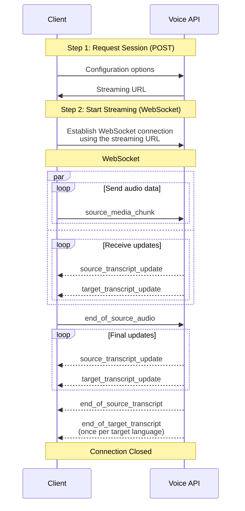

The Voice API provides real-time voice transcription and translation services. It consists of POST endpoint `voice/realtime` to initialize a session and a WebSocket endpoint `voice/realtime/connect` to stream audio data.

<Info>
  The Voice API is currently available to select DeepL API Pro customers only. Contact your DeepL representative for access.
</Info>

## Overview

The Voice API provides a way to open WebSocket streaming connections to transcribe and translate audio data. With each streaming connection, you can:

* Send a single audio stream
* Receive transcriptions in the source language
* Receive translations in multiple target languages

The API uses a two-step flow:
1. **Request a streaming URL** via POST request
2. **Stream audio** via WebSocket

## Supported Languages

All source languages can be translated into any target language.

<Accordion title="Show supported languages">
  <Columns cols={2}>
  <div>
    <b>Source languages</b>
    <div>Chinese (Mandarin)</div>
    <div>Dutch</div>
    <div>English</div>
    <div>French</div>
    <div>German</div>
    <div>Indonesian</div>
    <div>Italian</div>
    <div>Japanese</div>
    <div>Korean</div>
    <div>Polish</div>
    <div>Portuguese</div>
    <div>Romanian</div>
    <div>Russian</div>
    <div>Spanish</div>
    <div>Swedish</div>
    <div>Turkish</div>
    <div>Ukrainian</div>
  </div>
  <div>
    <b>Target languages</b>
    <div>Arabic</div>
    <div>Bulgarian</div>
    <div>Chinese (Simplified)</div>
    <div>Chinese (Traditional)</div>
    <div>Czech</div>
    <div>Danish</div>
    <div>Dutch</div>
    <div>English (American)</div>
    <div>English (British)</div>
    <div>Estonian</div>
    <div>Finnish</div>
    <div>French</div>
    <div>German</div>
    <div>Greek</div>
    <div>Hebrew</div>
    <div>Hungarian</div>
    <div>Indonesian</div>
    <div>Italian</div>
    <div>Japanese</div>
    <div>Korean</div>
    <div>Latvian</div>
    <div>Lithuanian</div>
    <div>Norwegian Bokmål</div>
    <div>Polish</div>
    <div>Portuguese (Brazil)</div>
    <div>Portuguese (Portugal)</div>
    <div>Romanian</div>
    <div>Russian</div>
    <div>Slovak</div>
    <div>Slovenian</div>
    <div>Spanish</div>
    <div>Swedish</div>
    <div>Turkish</div>
    <div>Ukrainian</div>
    <div>Vietnamese</div>
    </div>
  </Columns>
</Accordion>

## Two-Step API Flow

The Voice API uses a two-step flow to initiate streaming.

<Accordion title="Show streaming flow">

</Accordion>

<Steps>
  <Step title="Request Session and Stream URL">
    Make a POST request to obtain an ephemeral streaming URL and authentication token:

    ```http
    POST https://api.deepl.com/v1/voice/realtime
    ```

    This step handles:
    * Authentication and authorization
    * Main configuration options (audio format, languages, glossaries, etc.)

    See the [Get Streaming URL](/api-reference/voice/get-streaming-url) documentation for details.
  </Step>
  <Step title="Streaming Audio and Text (WebSocket)">
    Use the received URL to establish a WebSocket connection for:
    * Sending audio data
    * Receiving transcriptions and translations in real-time

    See the [WebSocket Streaming](/api-reference/voice/websocket-streaming) documentation for details.
  </Step>
</Steps>

## Limitations and Constraints

* Maximum 5 target languages per stream
* Maximum streaming connection duration: 3 hours
* Audio chunk size: should not exceed 100 kilobyte or 1 second duration
* Recommended chunk duration: 50-250 milliseconds for low latency
* Audio stream speed: maximum 2x real-time

## Getting Started

To start using the Voice API:

1. Ensure you have a DeepL API Pro account with Voice API access
2. Review the [Get Streaming URL](/api-reference/voice/get-streaming-url) documentation
3. Review the [WebSocket Streaming](/api-reference/voice/websocket-streaming) documentation
4. Choose your audio format and configuration
5. Implement the two-step flow in your application

<Info>
  For privacy and security, streaming URLs are ephemeral and valid for one-time use only. Once a WebSocket connection is established, you must send audio data to prevent connection closure.
</Info>
