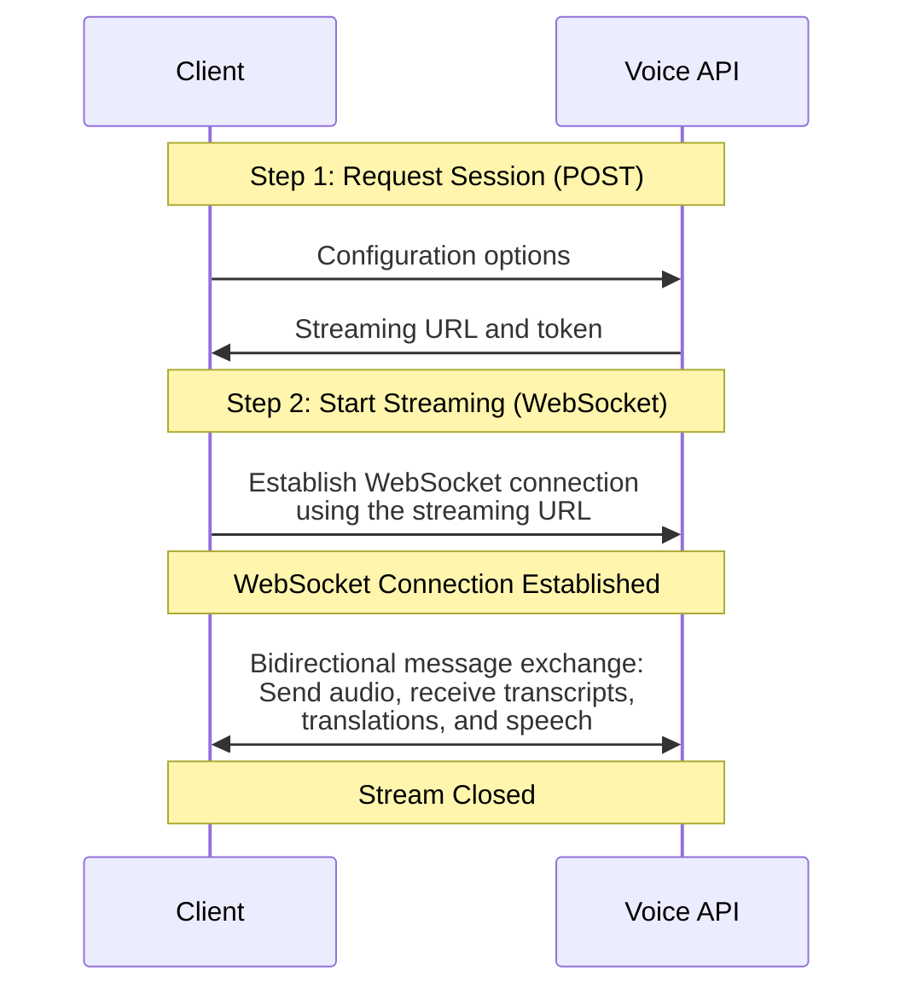
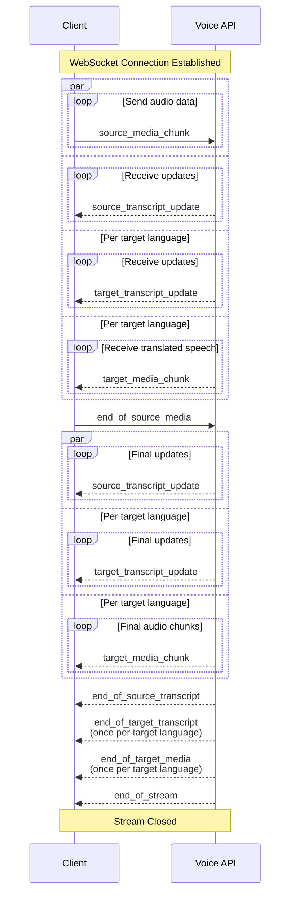

The Voice API provides real-time voice transcription and translation services using a WebSocket connection.

<Info>
    Speech transcription and translation are available to all customers with a paid DeepL API subscription. Translated speech is in <Badge color="green">closed beta</Badge> and subject to change.

    Please note that the existing provisions applying to customers' DeepL API Enterprise subscription also apply to
    DeepL Voice API speech to text with the following applicable additions to the
    [Terms and Conditions, the Service Specification and the Data
    Processing Agreement](/api-reference/voice/deepl-voice-api-service-specification-updates)
    (as new sub-processors have been added to serve specific languages for the Voice API).
</Info>

## Overview

The Voice API provides a way to open WebSocket connections to transcribe and translate audio data. With each connection, you can:

* Send a single audio stream
* Receive transcripts in the source language
* Receive translations in multiple target languages
* <Badge color="green">closed beta</Badge> Receive translated speech

The API uses a two-step flow:
1. [**Request a streaming URL**](/api-reference/voice/request-session) via POST request
2. [**Stream audio and text**](/api-reference/voice/websocket-streaming) via WebSocket

## Getting Started

To start using the Voice API:

1. Ensure you have a DeepL API Pro account with Voice API access
2. Review the [Request Session](/api-reference/voice/request-session) documentation
3. Review the [WebSocket Streaming](/api-reference/voice/websocket-streaming) documentation
4. Choose your audio format and configuration
5. Implement the two-step flow in your application

## Supported Languages

We support a wide range of source and target languages (see  below). However, while translation is always provided by
DeepL, for some languages we use external service partners to provide transcription and translated speech.
All source languages can be translated into any target language.

<Accordion title="Show supported languages">
| **Language** | **Transcription** | **Translation** | <Badge color="green">closed beta</Badge><br/>Translated Speech |
| :--- | :---: | :---: | :---: |
| Arabic                           | ⎋      | ✓      | ⎋            |
| Bengali                          | ⎋      | ✓      | —            |
| Bulgarian                        | ⎋      | ✓      | ⎋            |
| Chinese (Simplified/Traditional) | ✓      | ✓      | ✓            |
| Croatian                         | ⎋      | ✓      | —            |
| Czech                            | ✓      | ✓      | ⎋            |
| Danish                           | ⎋      | ✓      | ⎋            |
| Dutch                            | ✓      | ✓      | ✓            |
| English (American/British)       | ✓      | ✓      | ✓            |
| Estonian                         | ⎋      | ✓      | —            |
| Finnish                          | ✓      | ✓      | ⎋            |
| French                           | ✓      | ✓      | ✓            |
| German                           | ✓      | ✓      | ✓            |
| Greek                            | ⎋      | ✓      | ⎋            |
| Hebrew                           | ⎋      | ✓      | —            |
| Hungarian                        | ⎋      | ✓      | ⎋            |
| Indonesian                       | ✓      | ✓      | ⎋            |
| Irish                            | ⎋      | ✓      | —            |
| Italian                          | ✓      | ✓      | ✓            |
| Japanese                         | ✓      | ✓      | ✓            |
| Korean                           | ✓      | ✓      | ✓            |
| Latvian                          | ⎋      | ✓      | —            |
| Lithuanian                       | ⎋      | ✓      | —            |
| Maltese                          | ⎋      | ✓      | —            |
| Norwegian Bokmål                 | ⎋      | ✓      | ⎋            |
| Polish                           | ✓      | ✓      | ✓            |
| Portuguese (Brazil/Portugal)     | ✓      | ✓      | ✓            |
| Romanian                         | ✓      | ✓      | ⎋            |
| Russian                          | ✓      | ✓      | ✓            |
| Slovak                           | ⎋      | ✓      | ⎋            |
| Slovenian                        | ⎋      | ✓      | —            |
| Spanish                          | ✓      | ✓      | ✓            |
| Swedish                          | ✓      | ✓      | ✓            |
| Thai                             | ⎋      | ✓      | —            |
| Tagalog                          | ⎋      | ✓      | —            |
| Turkish                          | ✓      | ✓      | ✓            |
| Ukrainian                        | ✓      | ✓      | ⎋            |
| Vietnamese                       | ⎋      | ✓      | ⎋            |

✓ provided by DeepL / ⎋ provided by an external service partner / — not available
</Accordion>

<Warning>
    Language auto-detection is not yet supported for transcription provided by external service partners. For languages marked with ⎋
    you must explicitly specify the source language.
</Warning>

## Supported Audio Formats

The API supports various common combinations of streaming codecs and containers with a single channel (mono) audio stream.
For a detailed list of supported input audio formats, please refer to
[Source Media Content Type](/api-reference/voice/request-session).
For supported output audio formats refer to
[Target Media Content Type](/api-reference/voice/request-session).

| **Audio Codec**              | **Audio Container**                 | **Recommended Bitrate**                              |
| :--------------------------- | :---------------------------------- | :--------------------------------------------------- |
| **PCM** <Icon icon="star"/>  | **-**                               | **256 kbps (16kHz), default recommendation**         |
| **OPUS** <Icon icon="star"/> | **Matroska / MPEG-TS / Ogg / WebM** | **32 kbps, recommended for low bandwidth scenarios** |
| AAC                          | Matroska / MPEG-TS                  | 96 kbps                                              |
| FLAC                         | FLAC / Matroska / Ogg               | 256 kbps (16kHz)                                     |
| MP3                          | MPEG / Matroska                     | 128 kbps                                             |


## Connecting

The Voice API uses a two-step flow to initiate a session.

<Steps>
  <Step title="Request Session">
    Make a POST request `v3/voice/realtime` to obtain an ephemeral streaming URL and authentication token. The response will look like this:

    ```json
    {
      "streaming_url": "wss://api.deepl.com/v3/voice/realtime/connect",
      "token": "VGhpcyBpcyBhIGZha2UgdG9rZW4K",
      "session_id": "4f911080-cfe2-41d4-8269-0e6ec15a0354"
    }
    ```

    This step handles:
    * Authentication and authorization
    * Main configuration options (audio formats, languages, glossaries, message encoding, etc.)

    <Note>
      URL and token are valid for one-time use only.
    </Note>

    See the [Request Session](/api-reference/voice/request-session) documentation for details.
  </Step>
  <Step title="Streaming Audio and Text (WebSocket)">
    Use the received URL to establish a WebSocket connection to `wss://api.deepl.com/v3/voice/realtime/connect?token=VGhpcyBpcyBhIGZha2UgdG9rZW4K`.
    This step handles exchanging messages on the WebSocket connection:
    * Sending audio data
    * Receiving transcripts, translations, and translated speech in real-time

    Messages are sent as TEXT frames (JSON) or BINARY frames (MessagePack), depending on the `message_format` configured in Step 1.

    <Note>
      Once a WebSocket connection is established, you must send audio data to prevent connection closure within 30 seconds.
    </Note>

    See the [WebSocket Streaming](/api-reference/voice/websocket-streaming) documentation for details.
  </Step>
</Steps>

<Accordion title="Show flow diagram">
The following sequence diagram shows the complete flow.

```mermaid
sequenceDiagram
    participant Client
    participant Voice API

    Note over Client,Voice API: Step 1: Request Session (POST)

    Client->>Voice API: Configuration options
    Voice API->>Client: Streaming URL and token

    Note over Client,Voice API: Step 2: Start Streaming (WebSocket)

    Client->>Voice API: Establish WebSocket connection<br/>using the streaming URL

    Note over Client,Voice API: WebSocket Connection Established

    Client<<->>Voice API: Bidirectional message exchange:   <br/>Send audio, receive transcripts,<br/>translations, and speech

    Note over Client,Voice API: Stream Closed
```
</Accordion>

## Streaming Audio and Text

**Sending Source Audio**

Continuously send audio using [source media chunk](/api-reference/voice/websocket-streaming) messages.
Use smaller chunks to get a lower latency. The recommended chunk duration is 50-250 milliseconds for optimal performance.
Send an [end of source media](/api-reference/voice/websocket-streaming) message to signal that the
audio stream is complete and to finalize the processing.

**Receiving Transcripts and Translations**

As the audio is processed, transcripts and translations are delivered incrementally in real-time via
[source transcript updates](/api-reference/voice/websocket-streaming) and
[target transcript updates](/api-reference/voice/websocket-streaming):

* **Concluded segments** - Finalized text that will not change. These segments are sent once and remain fixed.
* **Tentative segments** - Preliminary text that may be refined as more audio context becomes available. These segments may be updated in subsequent messages.

Applications typically merge finalized content into the complete transcript and can display tentative content as
provisional that will be updated.

 <Badge color="green">closed beta</Badge> **Receiving Translated Speech**

Translated speech is delivered incrementally as speech-only audio via
[target media chunks](/api-reference/voice/websocket-streaming). To save on bandwidth,
the audio stream contains only synthesized speech without silence or padding. Depending on the
source audio content there will be pauses w/o data delivered.

Using the text and audio duration information in the response, you are able to mark currently spoken text in the
received translations or subtitle audio output.

<Accordion title="Show detailed message flow">
The following sequence diagram shows the detailed message exchange during streaming.

```mermaid
sequenceDiagram
    participant Client
    participant Voice API

    Note over Client,Voice API: WebSocket Connection Established

    par
      loop Send audio data
        Client->>Voice API: source_media_chunk
      end
    and
      loop Receive updates
        Voice API-->>Client: source_transcript_update
      end
    and Per target language
      loop Receive updates
        Voice API-->>Client: target_transcript_update
      end
    and Per target language
      loop Receive translated speech
        Voice API-->>Client: target_media_chunk
      end
    end

    Client->>Voice API: end_of_source_media

    par
      loop Final updates
        Voice API-->>Client: source_transcript_update
      end
    and Per target language
      loop Final updates
        Voice API-->>Client: target_transcript_update
      end
    and Per target language
      loop Final audio chunks
        Voice API-->>Client: target_media_chunk
      end
    end

    Voice API-->>Client: end_of_source_transcript

    Voice API-->>Client: end_of_target_transcript<br/>(once per target language)

    Voice API-->>Client: end_of_target_media<br/>(once per target language)

    Voice API-->>Client: end_of_stream

    Note over Client,Voice API: Stream Closed
```
`par` means parallel execution and `loop` means looped execution.
</Accordion>

## Reconnecting

Network connections are inherently unreliable.
Disconnections are unavoidable and must be planned for.
In case your connection gets disconnected, request a new authentication token to pick up where you left off.
Make a GET request `v3/voice/realtime?token=<your last authentication token>`.
The response will look like this:

```json
{
  "streaming_url": "wss://api.deepl.com/v3/voice/realtime/connect",
  "token": "VGhpcyBpcyBhIGZha2UgdG9rZW4K",
  "session_id": "4f911080-cfe2-41d4-8269-0e6ec15a0354"
}
```

Use the received URL and token to establish a new WebSocket connection.
Should another reconnection become necessary, repeat the procedure.

See the [Reconnect Session](/api-reference/voice/reconnect-session) documentation for details.

<Note>
Always use the latest authentication token to request a new authentication token.
The use of outdated tokens will invalidate your session for security reasons.
</Note>

<Note>
If you still have an active connection, requesting a reconnection token will disconnect you.
</Note>

## Message Encoding

The Voice API supports two message encoding formats for WebSocket communication.
For best developer experience, we recommend starting with the default JSON format
and later switch to MessagePack if you need better performance.

<Warning>
  WebSocket messages must be sent as TEXT frames when using JSON format, and as BINARY frames when using MessagePack format. Sending the wrong frame type will result in connection errors.
</Warning>

**JSON (Default)**

This format is human-readable and easy to debug.
Messages are JSON-encoded and sent as **TEXT** WebSocket frames.
Fields with binary data (such as audio chunks) are base64-encoded strings.

**MessagePack**

This format offers better bandwidth and performance characteristics.
Messages are [MessagePack](https://msgpack.org/)-encoded and sent as **BINARY** WebSocket frames. **Messages must be encoded as maps with string keys, not arrays** - ensure your MessagePack library is configured correctly.
Fields with binary data (such as audio chunks) contain raw binary data instead of base64-encoded strings.
Compared to JSON, MessagePack typically reduces bandwidth usage by 25-30% and improves message
encoding/decoding speed by 2x-4x.

<Info>
MessagePack messages **must be encoded as maps with string keys**,
not as arrays. The message structure must match the JSON schema exactly, with all field names
preserved as string keys (e.g., `{"source_media_chunk": {"data": <binary>}}`). Array-based encoding is not supported.

Ensure your MessagePack library is configured to encode objects as maps rather than arrays.
Some libraries default to array encoding for performance - check your library's documentation for the correct configuration.
</Info>

<CodeGroup>

```javascript JSON
// Raw binary audio data
const audioData = getAudioChunk();

// Base64 encode the audio data
const base64Audio = btoa(audioData);

const message = {
  source_media_chunk: {
    data: base64Audio
  }
};

// Send as TEXT frame
websocket.send(JSON.stringify(message));
```

```javascript MessagePack
import { pack } from 'msgpackr';

// Raw binary audio data
const audioData = getAudioChunk();

const message = {
  source_media_chunk: {
    data: audioData  // No base64 encoding needed
  }
};

// Send as BINARY frame
websocket.send(pack(message));
```

</CodeGroup>

## Usage Examples

You can find a reference usage example for python at our
[Github repository for the DeepL Python Library](https://github.com/DeepLcom/deepl-python/tree/main/examples/voice/cli).
There's no integration of the Voice API in the official DeepL SDKs yet, but you can use any WebSocket client library
to interact with the API.

## Limitations and Constraints

* Maximum 5 target languages per session
* Audio chunk size: should not exceed 100 kilobyte or 1 second duration
* Recommended chunk duration: 50-250 milliseconds for low latency
* Audio stream speed: maximum 2x real-time
* Timeout: If no data is received for 30 seconds, the session will be terminated
* Maximum connection duration: After 1 hour, the connection will be closed. You can establish a new connection by [reconnecting](/api-reference/voice/reconnect-session) to the session.
* Using any given token more than once to establish a WebSocket connection will terminate the associated session immediately for security reasons.
